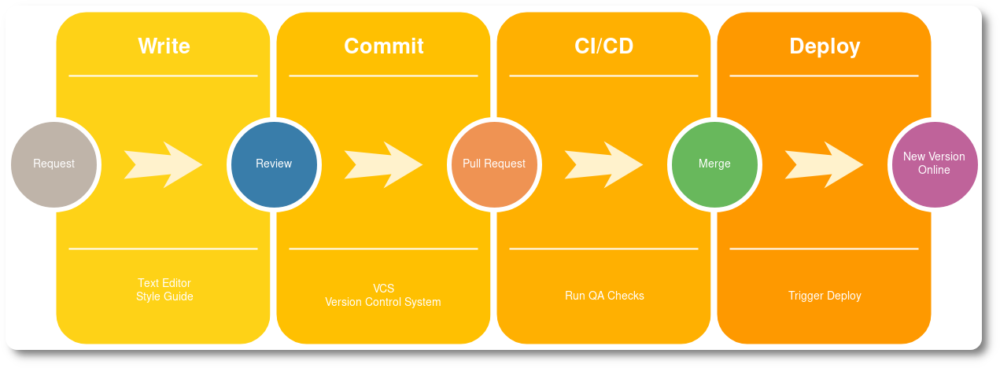

title: Rakpart - Documentation Quality Assurance - TestTheDocs
description: TestTheDocs Rakpart - A collection of checks which help to improve the quality of technical documentation.

# Documentation Quality Assurance

**Rakpart** is a collection of checks which help to improve the quality of technical documentation.

Explain better what is is and why it is called Rakpart.

---

Run the locally as container, as githook or with your editor

## Overview

### Markdown

All checks which have to do with [Markdown](linktomd.io).

- Markdown Lint
- Remark Lint

### reStructuredText

All links for [rest](rst.io)

- Doc8
- Toctree

### Editorial Style Guidelines

- Vale
- Textlint

### Others

- Linkcheck
- HTML Test
- Tab
- Trailing Space

### CI

How to use *Rakpart* with CI.

## Dependencies

- [Docker](https://www.docker.com/ "Docker Homepage")
