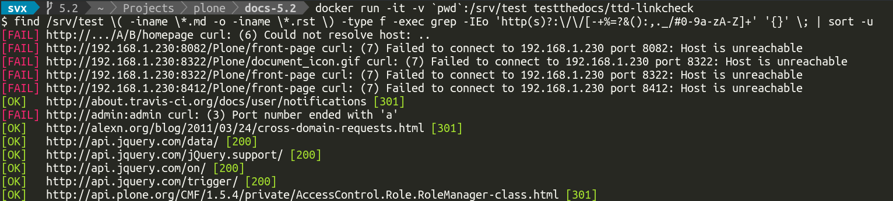

=============
TTD Linkcheck
=============

.. admonition:: Abstract

    Link validation for ``.md`` and ``.rst`` files.

Based on  `linkcheck <https://github.com/cytopia/linkcheck>`_

Installation
============

Dependencies
------------

- `Docker <https://docker.com>`_

Usage
=====

Navigate to the directory containing your reStructuredText (.rst) or markdown (.md) files.

.. code-block:: shell

   docker run -v `pwd`:/srv/docs testthedocs/ttd-linkcheck

Settings
--------

Default settings are configured in the `script itself <https://github.com/testthedocs/rakpart/blob/master/ttd-linkcheck/linkcheck>`_.

Source Code
===========

The code of `ttd-linkcheck` is located on `GitHub <https://github.com/testthedocs/rakpart/tree/master/ttd-linkcheck>`_.
