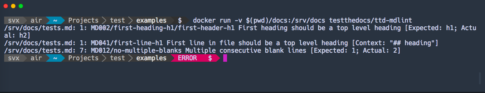

# Markdown Lint

!!! abstract

    Markdown Linter In A Container.

Based on: [markdownlint](https://github.com/DavidAnson/markdownlint) and [docker-markdown-lint](https://github.com/dcycle/docker-markdown-lint).

Another great alternative is [remark-lint](https://github.com/remarkjs/remark-lint).

## Configuration

You can change the config, by changing `config.json`, currenlty we ignore:

- [MD013](https://github.com/DavidAnson/markdownlint/blob/master/doc/Rules.md#md013)
- [MD033](https://github.com/DavidAnson/markdownlint/blob/master/doc/Rules.md#md033)
- [MD044](https://github.com/DavidAnson/markdownlint/blob/master/doc/Rules.md#md044)

Please see the [list](https://github.com/DavidAnson/markdownlint#rules--aliases) of all rules.

## Usage

```console
docker run -v $(pwd)/docs:/srv/docs testthedocs/ttd-mdlint
```

If you have any validations `ttd-mdlint` will report them.



## Source Code

The code of `ttd-mdlint` is located on [GitHub](https://github.com/testthedocs/rakpart/tree/master/ttd-mdlint).
