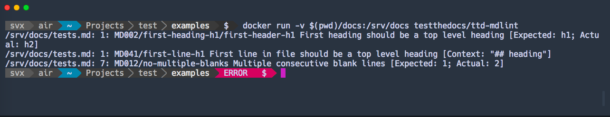

=================
TTD Markdown Lint
=================

.. admonition:: Abstract

    Markdown Linter In A Container.

Based on: `markdownlint <https://github.com/DavidAnson/markdownlint>`_ and `docker-markdown-lint <https://github.com/dcycle/docker-markdown-lint>`_.

Another great alternative is `remark-lint <https://github.com/remarkjs/remark-lint>`_.

Configuration
=============

You can change the config, by changing `config.json`, currenlty we ignore:

- `MD013 <https://github.com/DavidAnson/markdownlint/blob/master/doc/Rules.md#md013>`_
- `MD033 <https://github.com/DavidAnson/markdownlint/blob/master/doc/Rules.md#md033>`_
- `MD044 <https://github.com/DavidAnson/markdownlint/blob/master/doc/Rules.md#md044>`_

Please see the `list <https://github.com/DavidAnson/markdownlint#rules--aliases>`_ of all rules.

Usage
=====

.. code-block:: shell

    docker run -v `pwd`:/srv/docs testthedocs/ttd-mdlint

If you have any validations `ttd-mdlint` will report them.

Source Code
===========

The code of `ttd-mdlint` is located on `GitHub <https://github.com/testthedocs/rakpart/tree/master/ttd-mdlint>`_.
