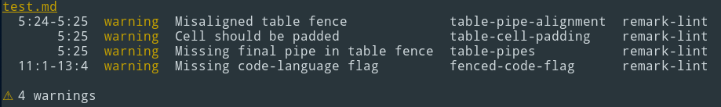

title: TTD Remark Lint - TestTheDocs
description: Rakpart - Markdown code style linter for CommonMark.

# TTD Remark Lint



## About

Markdown code style linter for [CommonMark](https://commonmark.org).

Based on [remark-lint](https://github.com/remarkjs/remark-lint) and [zemanlx/remark-lint](https://github.com/zemanlx/remark-lint).

## Usage

Run `remark-lint` from in your docs directory:

```shell
docker run --rm -i -v $PWD:/lint/input:ro testthedocs/ttd-remark .
```

Default configuration:

```yaml

plugins:
  preset-lint-consistent:
  preset-lint-markdown-style-guide:
  preset-lint-recommended:
  validate-links:
```
## Source Code

The code of *ttd-remark* is located on [GitHub](https://github.com/testthedocs/rakpart/tree/master/ttd-remark).
