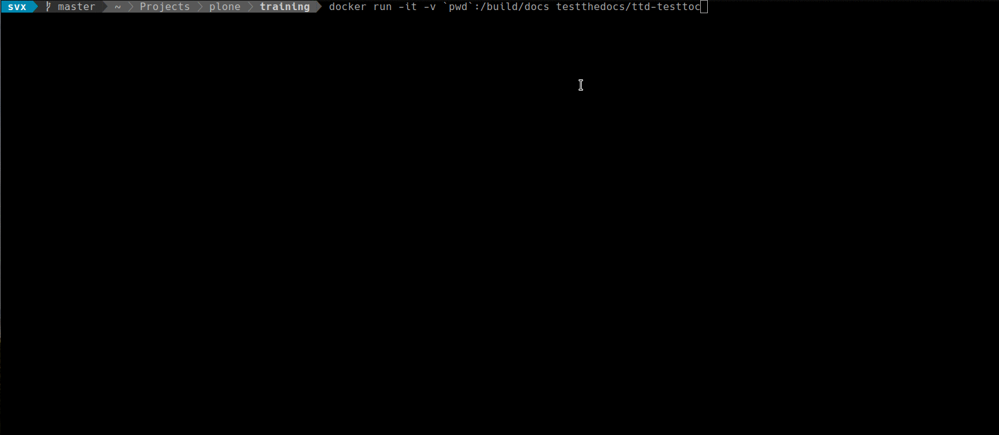

# Sphinx Toctree Test

!!! abstract

    Toctree Validation For Sphinx Based Documentation

This test checks for multiple `:numbered:` entries.

This tests checks all reStructuredText (`.rst`) files, if the test detects `:numbered:` in another file than `index.rst` it reports an error.

## Dependencies

None.

## Configuration

None.

## Usage

Navigate to the directory containing your reStructuredText (.rst) files.

```console
docker run -it -v `pwd`:/build/docs testthedocs/ttd-toctree
```



## Source Code

The code of `tts-toctree` is located on [GitHub](https://github.com/testthedocs/rakpart/tree/master/ttd-toctree).
