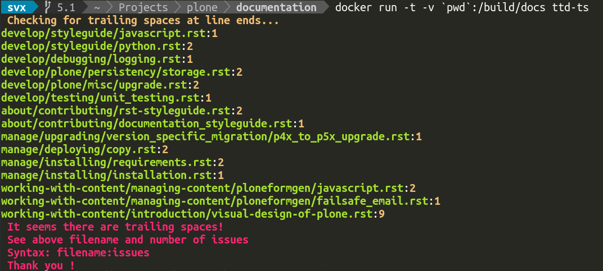
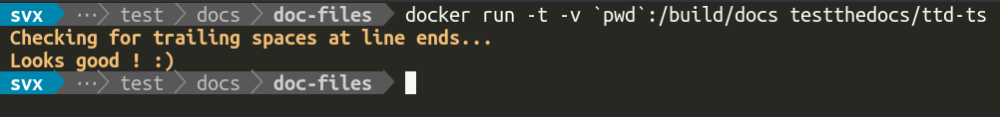

# Trailing Spaces

!!! abstract

    Check your `rst` based documentation for trailing spaces on line ends.

## Installation

### Dependencies

- [reStructuredText](http://docutils.sourceforge.net/rst.html)
- `index.rst`
- [Docker](https://www.docker.com/)

```console
docker pull testthedocs/ttd-ts
```

## Usage

If ttd-ts can not find a index.rst the test will fail.

The following example mounts your current working directory into the container and runs the check:

```console
docker run -t -v `pwd`:/build/docs testthedocs/ttd-ts
```

The script will report if it detects trailing spaces on line ends, if so it will show the name of the file and the number of issues.





## Source Code

The code of `tts-ts` is located on [GitHub](https://github.com/testthedocs/rakpart/tree/master/ttd-ts).
