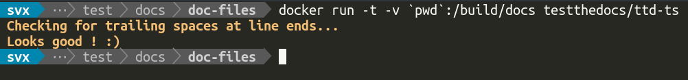

===================
TTD Trailing Spaces
===================

.. admonition:: Abstract

    Check your `rst` based documentation for trailing spaces on line ends.

Installation
============

Dependencies
------------

- `Docker <https://docker.com>`_

Usage
=====

If ttd-ts can not find an _index.rst_ the test fails.

The following example mounts your current working directory into the container and runs the check:

.. code-block:: shell

   docker run -t -v `pwd`:/build/docs testthedocs/ttd-ts

The script reports if it detects trailing spaces on line ends, and shows the name of the file and the number of issues.

Source Code
===========

The code of `ttd-ts` is located on `GitHub <https://github.com/testthedocs/rakpart/tree/master/ttd-ts>`_.
