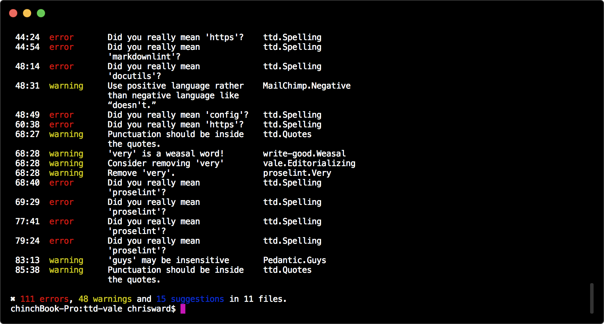

# Spelling, Grammar, Style and Readability Tests

!!! abstract

    Spelling, grammar, style and readability Linter In a container.

### Dependencies

[vale](https://valelint.github.io) and [Test the Docs Vale styles](https://github.com/testthedocs/vale-styles).

## Configuration

You can change the configuration by changing the `.vale.ini` file, or the individual check YAML files listed below, currently we check the following:

### Spelling

All spelling related tests generate `error`s.

-   [Spelling with a common list of technical exceptions](https://github.com/testthedocs/vale-styles/blob/master/ttd/Spelling.yml)

### Grammar

All grammar related tests generate `warning`s.:

-   [FutureTense](https://github.com/testthedocs/vale-styles/blob/master/ttd/FutureTense.yml)
-   [Passive voice, from write-good](https://github.com/testthedocs/vale-styles/blob/master/write-good/Passive.yml)
-   [Weasel words, from write-good](https://github.com/testthedocs/vale-styles/blob/master/write-good/Weasel.yml)
-   [Starting sentences with 'there is'](https://github.com/testthedocs/vale-styles/blob/master/write-good/ThereIs.yml)
-   Hedging words, from vale
-   Repetition of words, from vale
-   Editorializing language that adds nothing, from vale
-   [Future tense, from us](https://github.com/testthedocs/vale-styles/blob/master/ttd/FutureTense.yml)
-   [Unclear antecedent, from us](https://github.com/testthedocs/vale-styles/blob/master/ttd/UnclearAntecedent.yml)
-   [Unnecessary usage of 'very', from proselint](https://github.com/testthedocs/vale-styles/blob/master/proselint/Very.yml)
-   [Poor comparisons, from proselint](https://github.com/testthedocs/vale-styles/blob/master/proselint/Uncomparables.yml)
-   Ending a sentence with a preposition, from vale
-   [Use correct abbreviations, from 18F](https://github.com/errata-ai/vale/blob/master/styles/18F/Abbreviations.yml)

### Style

All style related tests generate `suggestion`s:

-   [Consistent use of diacritics, from proselint](https://github.com/testthedocs/vale-styles/blob/master/proselint/Diacritical.yml)
-   [Headings start with a capital, from the vale demo](https://github.com/errata-ai/vale/blob/master/styles/demo/HeadingStartsWithCapital.yml)
-   [Gender bias, from proselint](https://github.com/testthedocs/vale-styles/blob/master/proselint/GenderBias.yml)
-   Highlight litotes, from vale
-   [British English quote and punctuation combination](https://github.com/errata-ai/vale/blob/master/styles/18F/Quotes.yml)
-   [Negative language use, from MailChimp](https://github.com/errata-ai/vale/blob/master/styles/MailChimp/Negative.yml)
-   [Using 'guys'](https://github.com/errata-ai/vale/blob/master/styles/Pedantic/Guys.yml)
-   [List start with a capital letter, from OpenStack](https://github.com/errata-ai/vale/blob/master/styles/OpenStack/ListStart.yml)
-   [Starting sentences with 'so' or 'but', from write-good](https://github.com/testthedocs/vale-styles/blob/master/write-good/So.yml)

### Readability

All style related tests generate `suggestion`s.:

-   Annotations (from Vale) to flag remaining TODOs and other annotations in text
-   [Paragraph length from vale demo, set at 150 words](https://github.com/errata-ai/vale/blob/master/styles/demo/ParagraphLength.yml)
-   [Sentence length from vale demo, set at 25 words](https://github.com/errata-ai/vale/blob/master/styles/demo/SentenceLength.yml)
-   Overly complex text with [too Wordy from write-good](https://github.com/testthedocs/vale-styles/blob/master/write-good/TooWordy.yml), [avoid from MailChimp](https://github.com/errata-ai/vale/blob/master/styles/MailChimp/Avoid.yml), [terms from Pedantic](https://github.com/errata-ai/vale/blob/master/styles/Pedantic/Terms.yml), and [complex from PlainLanguage](https://github.com/errata-ai/vale/blob/master/styles/PlainLanguage/ComplexWords.yml)
-   Readability score

## Usage

```console
docker run -v $(pwd)/docs:/srv/docs testthedocs/ttd-vale
```

If you have any issues `ttd-vale` reports them, and the severity of the issue as defined by the `.vale.ini` file.



## Source Code

The code of `ttd-vale` is located on [GitHub](https://github.com/testthedocs/rakpart/tree/master/ttd-vale).
