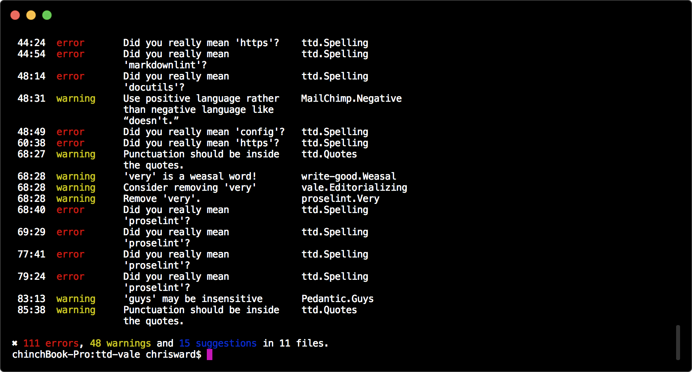

========
TTD Vale
========

.. admonition:: About

    Spelling, grammar, style and readability linter in a container.

Spelling
========

All spelling related tests generate *error`s*.

- `Spelling with a common list of technical exceptions <https://github.com/testthedocs/vale-styles/blob/master/ttd/Spelling.yml>`_

Grammar
-------

All grammar related tests generate *warning`s*.

- `FutureTense <https://github.com/testthedocs/vale-styles/blob/master/ttd/FutureTense.yml>`_
- `Passive voice, from write-good <https://github.com/testthedocs/vale-styles/blob/master/write-good/Passive.yml>`_
- `Weasel words, from write-good <https://github.com/testthedocs/vale-styles/blob/master/write-good/Weasel.yml>`_
- `Starting sentences with 'there is' <https://github.com/testthedocs/vale-styles/blob/master/write-good/ThereIs.yml>`_
- Hedging words, from vale
- Repetition of words, from vale
- Editorializing language that adds nothing, from vale
- `Future tense, from us <https://github.com/testthedocs/vale-styles/blob/master/ttd/FutureTense.yml>`_
- `Unclear antecedent, from us <https://github.com/testthedocs/vale-styles/blob/master/ttd/UnclearAntecedent.yml>`_
- `Unnecessary usage of 'very', from proselint <https://github.com/testthedocs/vale-styles/blob/master/proselint/Very.yml>`_
- `Poor comparisons, from proselint <https://github.com/testthedocs/vale-styles/blob/master/proselint/Uncomparables.yml>`_
- Ending a sentence with a preposition, from vale
- `Use correct abbreviations, from 18F <https://github.com/errata-ai/vale/blob/master/styles/18F/Abbreviations.yml>`_

Style
-----

All style related tests generate *suggestion`s*.

- `Consistent use of diacritics, from proselint <https://github.com/testthedocs/vale-styles/blob/master/proselint/Diacritical.yml>`_
- `Headings start with a capital, from the vale demo <https://github.com/errata-ai/vale/blob/master/styles/demo/HeadingStartsWithCapital.yml>`_
- `Gender bias, from proselint <https://github.com/testthedocs/vale-styles/blob/master/proselint/GenderBias.yml>`_
- Highlight litotes, from vale
- `British English quote and punctuation combination <https://github.com/errata-ai/vale/blob/master/styles/18F/Quotes.yml>`_
- `Negative language use, from MailChimp <https://github.com/errata-ai/vale/blob/master/styles/MailChimp/Negative.yml>`_
- `Using 'guys' <https://github.com/errata-ai/vale/blob/master/styles/Pedantic/Guys.yml>`_
- `List start with a capital letter, from OpenStack <https://github.com/errata-ai/vale/blob/master/styles/OpenStack/ListStart.yml>`_
- `Starting sentences with 'so' or 'but', from write-good <https://github.com/testthedocs/vale-styles/blob/master/write-good/So.yml>`_

Readability
-----------

All style related tests generate *suggestion`s*.

- Annotations (from Vale) to flag remaining TODOs and other annotations in text
- `Paragraph length from vale demo, set at 150 words <https://github.com/errata-ai/vale/blob/master/styles/demo/ParagraphLength.yml>`_
- `Sentence length from vale demo, set at 25 words <https://github.com/errata-ai/vale/blob/master/styles/demo/SentenceLength.yml>`_
- Overly complex text with `too Wordy from write-good <https://github.com/testthedocs/vale-styles/blob/master/write-good/TooWordy.yml>`_, `avoid from MailChimp <https://github.com/errata-ai/vale/blob/master/styles/MailChimp/Avoid.yml>`_, `terms from Pedantic <https://github.com/errata-ai/vale/blob/master/styles/Pedantic/Terms.yml>`_, and `complex from PlainLanguage <https://github.com/errata-ai/vale/blob/master/styles/PlainLanguage/ComplexWords.yml>`_
- Readability score

Usage
=====

.. code-block:: console

   docker run -it -v `pwd`:/srv/tests testthedocs/ttd-vale

If you have any issues `ttd-vale` reports them, and the severity of the issue as defined by the `.vale.ini` file.

Source Code
===========

The code of `ttd-vale` is located on `GitHub <https://github.com/testthedocs/rakpart/tree/master/ttd-vale>`_.
