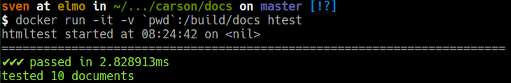

========
TTD HTML
========

Debain based docker container for running HTML checks.
Based on `htmltest <https://github.com/wjdp/htmltest>`_.

Features
========

- Runs HTML checks against documentation.

Dependencies
============

- `Docker <https://docker.com>`_

Installation
============

Pull the image:

.. code-block:: shell

   docker pull testthedocs/ttd-htmltest

Usage
=====

Out of the box (OOTB) *ttd-htmltest* is configured to run checks against the directory ``_build/html``.

This directory is usually located in your *docs* directory.

If you use a different setup, you have to create your own ``.html.yml``.

You can find more information in the `htmltest repository <https://github.com/wjdp/htmltest>`_.

Run The Test
------------

.. code-block shell

   docker run -it -v `pwd`:/srv/test testthedocs/ttd-htmltest

Contribute
==========

- `Issue Tracker <https://github.com/testthedocs/rakpart/issues>`_
- `Source Code <https://github.com/testthedocs/rakpart/tree/master/ttd-htmltest>`_

Support
=======

If you are having issues, please let us know.

License
=======

`MIT <https://choosealicense.com/licenses/mit/>`_
