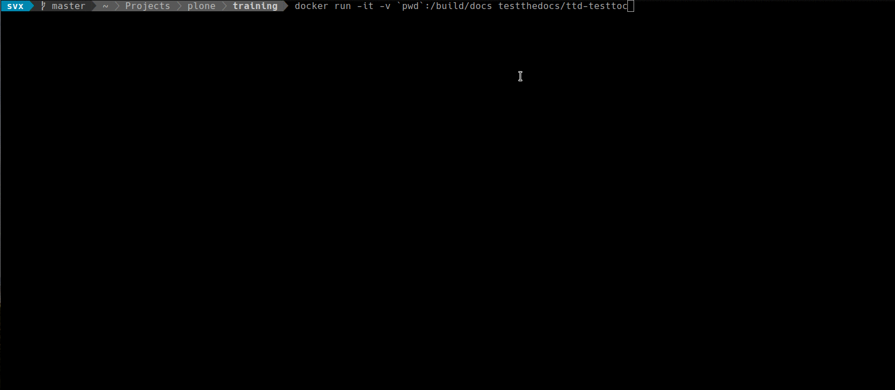

# ttd-toctree

QA Test (Toctree Validation) For Sphinx Based Documentation

This test checks for multiple `:numbered:` entries.

Following our write guidelines we allow this setting **once**
in *index.rst*.

This tests checks all reStructuredText (.rst) files, if the test detects
`:numbered:` in another file than *index.rst* it will report an error.

## Features

- Small Image, based on [Alpine Linux](http://www.alpinelinux.org/).
- Uses [Tini](https://github.com/krallin/tini) as `init`.
- Uses [su-exec](https://github.com/ncopa/su-exec) for setting permissions.
- Uses [The Silver Searcher](https://geoff.greer.fm/ag/) for speed and better configuration.

## Documentation

Full documentation for end users can be found in the ["docs"](..docs/) folder.

## Dependencies

- [Docker](https://docker.com "Homepage of docker")

## Installation

Pull the image:

```
docker pull testthedocs/ttd-toctree
```

## Usage

Navigate to the directory containing your reStructuredText (.rst) files.

### Run The Test

```
docker run -it -v `pwd`:/build/docs testthedocs/ttd-toctree
```



## Contribute

- [Issue Tracker](github.com/testthedocs/rakpart/issues)
- [Source Code](https://github.com/testthedocs/rakpart/tree/master/ttd-toctree)

## Support

If you are having issues, please let us know.

## License

`MIT <https://choosealicense.com/licenses/mit/>`_
