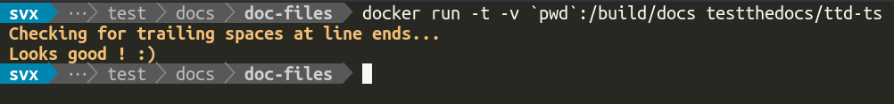

===============
Trailing Spaces
===============

.. rubric:: About

Check your documentation for trailing spaces on line ends.

Installation
============

Dependencies
------------

- `Docker <https://docker.com/>`_

.. code-block:: console

   docker pull testthedocs/ttd-ts

Usage
=====

Requirements
------------

This check is written for *reST* based documentation.

If ``ttd-ts`` can not find a *index.rst* the test will fail.

The following example mounts your *current working directory* into the container and runs the check:

.. code-block:: console

   docker run -t -v `pwd`:/build/docs testthedocs/ttd-ts

The script will report if it detects trailing spaces on line ends, if so it will show the name of the file and the
number of issues.

.. code-block:: console

   $FILENAME:$AMOUNT

Examples:

.. image:: _static/ttd-ts-screen.png
   :alt: Example Usage 1
   :align: center

