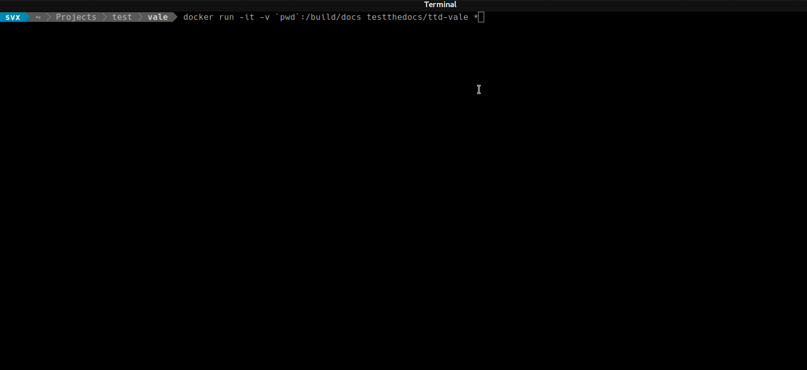

# ttd-vale
Debain Based Docker Container For Running Style Guide Checks Based On [Vale](https://github.com/ValeLint/vale)

## Features

- Runs style guide checks against documentation

## Dependencies

- [Docker](https://docker.com "Homepage of docker")

## Installation

Pull the image:

```
docker pull testthedocs/ttd-vale
```


## Usage

Navigate to the directory containing your reStructuredText (.rst) files.

### Run The Test

``` bash
docker run -it -v `pwd`:/build/docs testthedocs/ttd-vale *
```

If you do not want to check *all* files replace the ``*`` with the name of the file you want to check

``` bash
docker run -it -v `pwd`:/build/docs testthedocs/ttd-vale index.rst
```




## Contribute

- [Issue Tracker](github.com/testthedocs/ttd-vale/issues)
- [Source Code](github.com/testthedocs/ttd-vale)

## Support

If you are having issues, please let us know.

## License

The project is licensed under the GPLv2.
